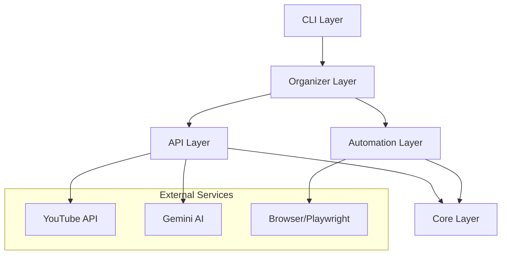

# Architecture Documentation

## System Overview

The YouTube Playlist Organizer is built with a modular, layered architecture that separates concerns and promotes maintainability.

## Layer Responsibilities

### Core Layer (`src/yt_organizer/core/`)
- **Purpose**: Foundation components used throughout the application
- **Components**:
  - `config.py`: Configuration management with validation
  - `models.py`: Data models (Video, Playlist, etc.)
  - `constants.py`: Application-wide constants
  - `exceptions.py`: Custom exception hierarchy
  - `logging.py`: Logging configuration and utilities

### API Layer (`src/yt_organizer/api/`)
- **Purpose**: External API integrations
- **Components**:
  - `auth.py`: OAuth authentication management
  - `youtube.py`: YouTube Data API v3 client
  - `gemini.py`: Google Gemini AI client

### Automation Layer (`src/yt_organizer/automation/`)
- **Purpose**: Browser automation for operations not available via API
- **Components**:
  - `base.py`: Base browser automation functionality
  - `watch_later.py`: Watch Later specific automation

### Organizer Layer (`src/yt_organizer/organizers/`)
- **Purpose**: Business logic and orchestration
- **Components**:
  - `topic_classifier.py`: AI-based video organization
  - `playlist_manager.py`: Playlist operations

### CLI Layer (`src/yt_organizer/cli/`)
- **Purpose**: User interface and command handling
- **Components**:
  - `main.py`: Command definitions and entry point

## Data Flow

### Organize Command Flow
1. User invokes `yt-organizer organize`
2. CLI validates arguments and loads configuration
3. AuthManager handles OAuth authentication
4. YouTubeClient fetches videos from playlist
5. GeminiClient classifies each video by topic
6. TopicOrganizer creates/updates playlists
7. Results displayed to user

### Browser Automation Flow
1. User invokes `yt-organizer move-browser`
2. CLI validates arguments and loads configuration
3. BrowserAutomation launches Playwright
4. WatchLaterAutomation navigates to YouTube
5. Handles login if needed
6. Automates UI interactions to move videos
7. Progress saved periodically

## Key Design Patterns

### Dependency Injection
- Clients receive dependencies via constructor
- Enables testing with mock objects
- Example: `YouTubeClient(auth_manager, settings)`

### Factory Pattern
- Models provide `from_api_response()` factory methods
- Consistent object creation from API data

### Strategy Pattern
- Different organizers implement different strategies
- TopicOrganizer vs PlaylistManager

### Repository Pattern
- API clients abstract data access
- Business logic doesn't depend on API details

## Configuration Management

Settings are loaded in priority order:
1. Command-line arguments (highest)
2. Environment variables
3. `.env` file
4. Default values (lowest)

## Error Handling Strategy

- Custom exception hierarchy rooted at `YTOrganizerError`
- Specific exceptions for different failure modes
- Graceful degradation when possible
- User-friendly error messages

## Security Considerations

- OAuth tokens stored locally in `token.json`
- Client secrets never committed to repository
- API keys managed via environment variables
- Browser automation uses persistent profiles

## Performance Optimizations

- Lazy loading of API services
- Progress tracking for resume capability
- Batch operations where possible
- Configurable rate limiting

## Testing Strategy

- Unit tests for models and utilities
- Integration tests for API clients
- Mock external services in tests
- Fixtures for common test data

## Future Extensibility

The architecture supports:
- New organizer strategies
- Additional API integrations
- Alternative UI implementations
- Plugin system for custom features
